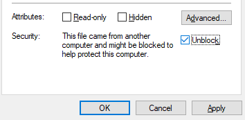
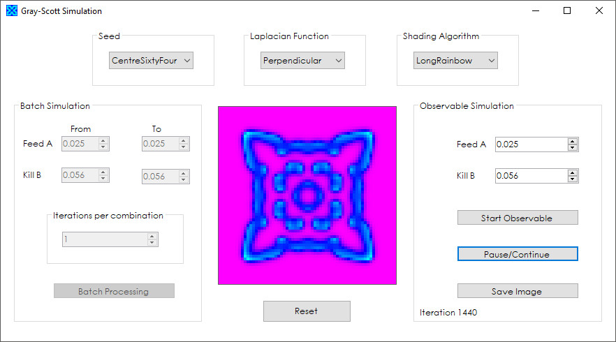

# GrayScott

A basic Gray Scott diffusion reaction simulation as coded for IN710 Object Oriented Systems Development, semester 1, 2017.

Written in Visual C# using Visual Studio 2015.

### Read about Gray-Scott Diffusion Reaction
http://www.karlsims.com/rd.html    
https://groups.csail.mit.edu/mac/projects/amorphous/GrayScott/    
https://mrob.com/pub/comp/xmorphia/    

### Build

<a href="https://github.com/kellybs1/GrayScott/blob/master/Builds/ReactionAssignment.exe?raw=true">/Builds/ReactionAssignment.exe</a>

Note: You may need to unblock the executable: Right click the exe -> Properties, and in the bottom section click the Unblock checkbox and then click OK.

### Source

<a href="https://github.com/kellybs1/GrayScott/tree/master/ReactionAssignment">/ReactionAssignment</a>

### Screenshot

### Notes
Contains bugs: An educational project only    
Batch processing automatically creates bitmaps in build directory. Sometimes very many    
